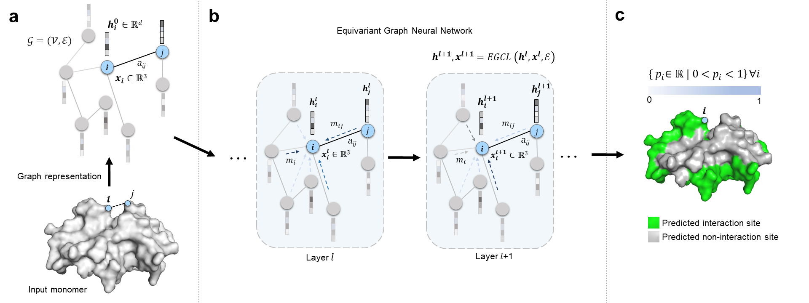

# EquiPPIS



## Abstract
The knowledge of protein-protein interaction provides a crucial steppingstone to drug design and discovery. To mitigate the cost and time consumed by experimental methods for protein-protein interaction site determination, many computational prediction methods have been developed leveraging the recent progress made in machine learning. However, sequence-based prediction methods suffer from the lack of structural information, while structural-based prediction methods with superior performance become impractical in short of experimentally determined monomeric structures that are taken as input. Here we present EquiPPIS, a deep E(3)-equivariant graph neural network capable of learning a more meaningful representation from structural information, that results in a robust model scalable to utilize predicted structures, bridging the gap between sequence-and structure-based methods. In addition, we propose a feature set introducing several novel features; and with reduced computational overhead by avoiding multiple sequence alignment. In a widely used benchmarking dataset, EquiPPIS outperforms the existing state-of-the-art methods by a large margin.


## Installation
We recommend conda virtual environment to install dependencies for EquiPPIS. The following command will create a virtual environment named 'EquiPPIS'

`conda env create -f EquiPPIS_environment.yml`

Then activate the virtual environment

`conda activate EquiPPIS`

That's it! EquiPPIS is ready to be used.

## Usage

To see usage instructions, run `python EquiPPIS.py -h`

```
usage: EquiPPIS.py [-h] [--model MODEL] [--model_state_dict MODEL_STATE_DICT] [--outdir OUTDIR] [--num_workers NUM_WORKERS]

options:
  -h, --help            show this help message and exit
  --model MODEL         String name of model
  --model_state_dict MODEL_STATE_DICT
                        Saved model
  --outdir OUTDIR       Prediction output directory
  --num_workers NUM_WORKERS
                        Number of data loader workers

```

We give an example of running EquiPPIS on several targets as follows.

- First preprocess input data to generate features [here](Preprocessing/)
- Make an output directory `mkdir output`
- Run `python EquiPPIS.py --model_state Trained_model/335_118_256hf_10l_14dist_epoch50_lr1e_4/E-l10-256.pt --outdir output`

The PPI sites predictions are generated at `output/`. 

EquiPPIS is very fast. On average it takes a fraction of second on a single core to run EquiPPIS for a target using processed features. However, the running time depends on the sequence length of the target protein. 
## Model

Trained model for EquiPPIS can be found [here](Trained_model/335_118_256hf_10l_14dist_epoch50_lr1e_4/E-l10-256.pt)

## Cite

